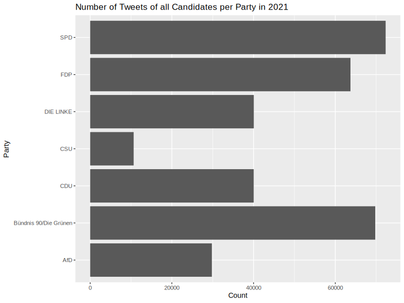
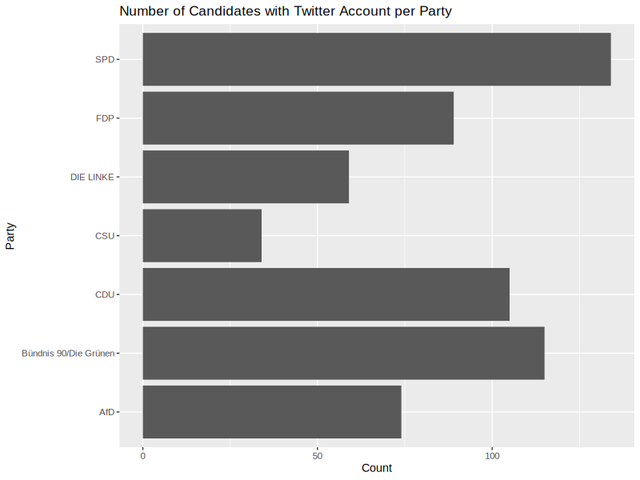
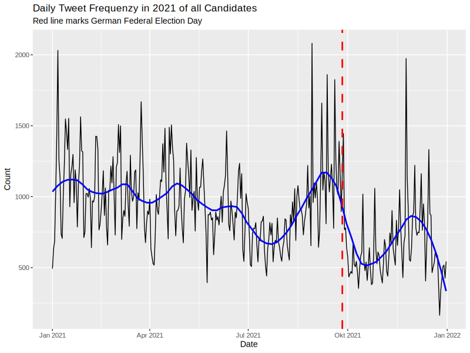

# Analyzing Political Communication on Twitter with NLP (2024)
This project, which is currently being implemented, aims to use natural language processing to analyze over 330,000 self-collected tweets from all Bundestag candidates represented on Twitter (X) in 2021. The project is split into two parts and training/deployment runs via the Google Cloud Platform (GCP):

First, I have classified all tweets according to their political content with PyTorch using the already pre-trained manifestoberta model. These will now be analyzed with logistic multi-level regressions to examine the determinants of specific content across the election campaign. Manifestoberta is based on the multilingual XLM-RoBERTa-Large models, which were tuned on all annotated statements in the text corpus of the MANIFESTO project.

As a second project, I will train and deploy my own model for the classification of negative campaigning based on the tweets using SpaCy. The final goal is to analyze all classified tweets for determinants and dynamics of campaign communication using network analysis and regression models. 

Stay tuned for updates on the project's progress!

## First exploratory data analysis (EDA) of the tweets





## Examples of current code for Part 1 of the Project:

> [!IMPORTANT]
> Please note that this code is still under construction. If there are any bugs, missing code or you have any questions, please feel free to contact me. I am happy to provide further information or insights.


### Preparing the Tweets for the Model

#### Setup Python
```{python}
import pandas as pd
import nltk
import re
import os
import numpy as np

nltk.download('punkt')
nltk.download('averaged_perceptron_tagger')
nltk.download('maxent_ne_chunker')
nltk.download('words')
```

#### Load Data
```{python}
#| label: load_data
#| echo: false
#| message: false
#| warning: false
#| eval: True

# Read the CSV file into Python
tweets = pd.read_csv(os.path.join(os.path.dirname(__file__), "../data/GER2021_CandidatesTweets_FullYear.csv"))
# Remove rows where id is duplicated
tweets = tweets.drop_duplicates(subset='id')
# Remove rows where 'text' is NaN
tweets = tweets.dropna(subset=['text'])
# Remove rows where 'text' is an empty string
tweets = tweets.loc[tweets['text'] != '']
# Remove rows where 'text' contains only one word
tweets = tweets[["id", "text"]]

```

#### Preprocessing
```{python}
class ProcessingPipeline:
  def remove_elements(self, text):
      # Remove emojis by matching the unicode for emojis
      emoji_pattern = re.compile("["
        u"\U0001F600-\U0001F64F"  # emoticons
        u"\U0001F300-\U0001F5FF"  # symbols & pictographs
        u"\U0001F680-\U0001F6FF"  # transport & map symbols
        u"\U0001F1E0-\U0001F1FF"  # flags (iOS)
        u"\U00002500-\U00002BEF"  # chinese char
        u"\U00002702-\U000027B0"
        u"\U000024C2-\U0001F251"
        u"\U0001f926-\U0001f937"
        u"\U00010000-\U0010ffff"
        u"\u2640-\u2642" 
        u"\u2600-\u2B55"
        u"\u200d"
        u"\u23cf"
        u"\u23e9"
        u"\u231a"
        u"\ufe0f"  # dingbats
        u"\u3030"
                      "]+", flags=re.UNICODE)
      text = emoji_pattern.sub(r'', text)

      # Remove links by matching the common patterns for URLs
      url_pattern = re.compile(r'http[s]?://(?:[a-zA-Z]|[0-9]|[$-_@.&+]|[!*\\(\\),]|(?:%[0-9a-fA-F][0-9a-fA-F]))+')
      text = url_pattern.sub(r'', text)

      # Remove hashtags
      hashtag_pattern = re.compile(r'#\w+')
      text = hashtag_pattern.sub(r'', text)

      # Remove numbers
      number_pattern = re.compile(r'\d+')
      text = number_pattern.sub(r'', text)

      # Remove dates in the format dd.mm.yyyy
      date_pattern = re.compile(r'\b(0?[1-9]|[12][0-9]|3[01])\.(0?[1-9]|1[012])\.(19|20)?\d\d\b')
      text = date_pattern.sub(r'', text)

        # Remove dates in the format dd. Month
      month_names = ['Januar', 'Februar', 'März', 'April', 'Mai', 'Juni', 'Juli', 'August', 'September', 'Oktober', 'November', 'Dezember']
      for month in month_names:
          date_pattern_month = re.compile(r'\b(0?[1-9]|[12][0-9]|3[01])\. ' + month + r'\b', flags=re.IGNORECASE)
          text = date_pattern_month.sub(r'', text)

      # Remove dates in the format dd-mm-yyyy or dd/mm/yyyy
      date_pattern = re.compile(r'\b(0?[1-9]|[12][0-9]|3[01])[-/](0?[1-9]|1[012])[-/](19|20)?\d\d\b')
      text = date_pattern.sub(r'', text)


      # Remove time in the format hh:mm or hh:mm:ss
      time_pattern = re.compile(r'\b([01]?[0-9]|2[0-3]):[0-5][0-9](:[0-5][0-9])?\b')
      text = time_pattern.sub(r'', text)


      return text
  
  def cleaning_text(self, df):
    # Apply the function to the 'context' column
      df['text'] = df['text'].apply(self.remove_elements)
      
      return df

# Create an instance of the ProcessingPipeline class
pipeline = ProcessingPipeline()
# Clean the text in the 'text' column of the DataFrame using the cleaning_text method
tweets = pipeline.cleaning_text(tweets)

# Remove empty or unuseful tweets
# Remove rows where 'text' is NaN
tweets = tweets.dropna(subset=['text'])
# Remove rows where 'text' is an empty string
tweets = tweets.loc[tweets['text'] != '']
# Remove rows where 'text' is an empty string or only contains whitespace
tweets = tweets.loc[tweets['text'].str.strip() != '']
# Remove rows where 'text' contains only one word
tweets = tweets[tweets['text'].str.split().str.len() > 2]

# Function to extract sentences from text
def extract_sentences(text):
  # Use NLTK to split the text into sentences
  sentences = nltk.sent_tokenize(text, 'german')
  # Filter the sentences to only include those with more than 4 words
  filtered_sentences = [
    sentence for sentence in sentences 
    if len(nltk.word_tokenize(sentence, 'german')) >= 2
  ]
  # Return the filtered sentences
  return filtered_sentences


# Assuming 'text' is the column containing the text, apply the extract_sentences function to each row
tweets.loc[:, 'sentences'] = tweets['text'].apply(extract_sentences)

# Create new columns for each sentence
# Convert the list of sentences in each row into a DataFrame, creating a new column for each sentence
sentences_df = pd.DataFrame(tweets['sentences'].to_list(), columns=[f'sentence_{i}' for i in range(1, tweets['sentences'].str.len().max() + 1)])

# Reset the indices
tweets = tweets.reset_index(drop=True)
sentences_df = sentences_df.reset_index(drop=True)

# Concatenate the DataFrames
tweetsdf = pd.concat([tweets, sentences_df], axis=1)

# Remove the 'sentences' column as it is no longer needed
tweetsdf = tweetsdf.drop(columns=['sentences'])

# Create a context column for the Context Model
tweetsdf[["context"]] = tweetsdf[["text"]]

# Keep only rows where 'Sentence_12' is NaN
tweetsdf = tweetsdf[tweetsdf['sentence_12'].isna()]

# Remove columns 'sentence_12' to 'sentence_16'
tweetsdf = tweetsdf.drop(columns=[f'sentence_{i}' for i in range(13, 17)])

# Save the data
tweetsdf.to_csv(os.path.join(os.path.dirname(__file__), "../data/prepared_data/GER2021_CandidatesTweets_FullYear_preprocessed.csv"), index=False)
tweetsdf.to_excel(os.path.join(os.path.dirname(__file__), "../data/prepared_data/GER2021_CandidatesTweets_FullYear_preprocessed.xlsx"), index=False)

```

#### Save Data

```{python}
# Save the data
tweetsdf.to_csv(os.path.join(os.path.dirname(__file__), "../data/prepared_data/GER2021_CandidatesTweets_FullYear_preprocessed.csv"), index=False)
tweetsdf.to_excel(os.path.join(os.path.dirname(__file__), "../data/prepared_data/GER2021_CandidatesTweets_FullYear_preprocessed.xlsx"), index=False)

```

#### Create Validation Dataset for Inta-Coder-Reliability-Tests (Human-Model) 
```{python}

# Set a random seed for reproducibility
np.random.seed(42)

# Randomly select 1000 rows for the validation set
validation_set = tweetsdf.sample(n=1000)

tweetsdf.to_csv(os.path.join(os.path.dirname(__file__), "../data/validation_data/GER2021_CandidatesTweets_validation_computercoder.csv"), index=False)
tweetsdf.to_excel(os.path.join(os.path.dirname(__file__), "../data/validation_data/GER2021_CandidatesTweets_validation_computercoder.xlsx"), index=False)

# Remove rows where 'text' contains only one word
tweets = tweets[["id", "text"]]

tweetsdf.to_csv(os.path.join(os.path.dirname(__file__), "../data/validation_data/GER2021_CandidatesTweets_validation_humancoder.csv"), index=False)
tweetsdf.to_excel(os.path.join(os.path.dirname(__file__), "../data/validation_data/GER2021_CandidatesTweets_validation_humancoder.xlsx"), index=False)

```


#### Create Batches

```{python}
# Split the DataFrame into batches
batches = np.array_split(tweetsdf, 8)

dir_path = os.path.join(os.path.dirname(__file__), "../data/prepared_data/")

# Save each batch as a separate CSV and Excel file in the specified directory
for i, batch in enumerate(batches):
    batch.to_csv(os.path.join(dir_path, f'tweets_batch{i+1}.csv'), index=False)
    batch.to_excel(os.path.join(dir_path, f'tweets_batch{i+1}.xlsx'), index=False)

```


### Model Adjustments and Deployment Examples (Full context model with CUDA Optimization + Multi-Threading)

```{python}
import pandas as pd
import numpy as np
from concurrent.futures import ThreadPoolExecutor
import torch as torch
torch.cuda.is_available()
device = torch.device("cuda" if torch.cuda.is_available() else "cpu")
torch.set_default_device(device)
from transformers import AutoModelForSequenceClassification, AutoTokenizer

# Read the CSV file into Python
tweets = pd.read_csv("tweets.csv")

# Ihr Modell und Tokenizer
model = AutoModelForSequenceClassification.from_pretrained("manifesto-project/manifestoberta-xlm-roberta-56policy-topics-context-2023-1-1", trust_remote_code=True)
tokenizer = AutoTokenizer.from_pretrained("xlm-roberta-large")

# Angenommen, Ihr DataFrame heißt df und hat Spalten 'sentence1', 'sentence2', ..., 'sentenceN'
# und 'context'

# model = model.to('cuda')

def get_predictions(sentence, context):
    # Convert sentence and context to strings if they are not already
    device = torch.device("cuda" if torch.cuda.is_available() else "cpu")
    sentence = str(sentence)
    context = str(context)
    predictions = []
    inputs = tokenizer(sentence,
                       context,
                       return_tensors="pt",
                       max_length=300,  #we limited the input to 300 tokens during finetuning
                       padding="max_length",
                       truncation=True
                       )

    # Move the inputs to the device
    inputs = {name: tensor.to(device) for name, tensor in inputs.items()}

    logits = model(**inputs).logits

    probabilities = torch.softmax(logits, dim=1).tolist()[0]
    probabilities = {model.config.id2label[index]: round(probability * 100, 2) for index, probability in enumerate(probabilities)}
    probabilities = dict(sorted(probabilities.items(), key=lambda item: item[1], reverse=True))

    predicted_class = model.config.id2label[logits.argmax().item()]
    predictions.append(predicted_class)
    return probabilities, predicted_class

# Finden Sie alle Spalten, die mit "sentence" beginnen
sentence_columns = [col for col in tweets.columns if col.startswith('sentence')]

# Define a function to apply get_predictions to each row of a DataFrame
def apply_predictions(df):
    for column in sentence_columns:
        results = df.apply(lambda row: get_predictions(row[column], row['context']), axis=1)
        df[f'{column}_prediction'] = results.apply(lambda x: x[0])
        df[f'{column}_predicted_class'] = results.apply(lambda x: x[1])
    return df

# Use multi-threading to apply the function to each chunk of the DataFrame
with ThreadPoolExecutor(max_workers= 4 ) as executor:
    results = list(executor.map(apply_predictions, [df for _, df in tweets.groupby(np.arange(len(tweets)) // 250)]))

# Append predictions to the Tweets-Dataframe
tweets = pd.concat(results)

# Save the data
tweetsdf.to_csv(os.path.join(os.path.dirname(__file__), "../data/tweets_classified"), index=False)
tweetsdf.to_excel(os.path.join(os.path.dirname(__file__), "../data/tweets_classified.xlsx"), index=False)
```

